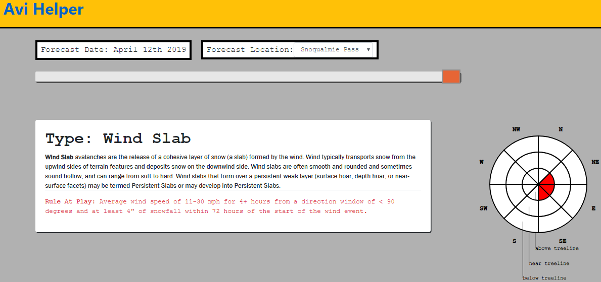

# AviHelper

Outdoor recreationists and avalanche professionals die every year in avalanches across the nation and the world. Traveling safely in avalanche prone terrain requires careful analysis of historical and current weather data, some of which is performed for the public by institutions such as NWAC(Northwest Avalanche Center). 

AviHelper is a web application that pulls raw weather data and uses custom algorithms to make predictions about avalanche dangers specific to location, elevation, and aspect. AviHelper also generates associated visualizations with d3.js and provides for user interactivity with targeted data. Currently all raw weather data is scraped from the NWAC data portal.

## Functionality

Loading the home page will automatically set the forecast date at the current day. If the app is set in demo mode, it will load a starting forecast date of April 12, 2019. 

Adjusting the slider will adjust the forecast date and associated avalanche predictions in real time without a refresh. The forecast active data set for any day includes any predicted avalanche danger events that occur in the 10 days prior to the forecast date.

If any avalanche problems are predicted to be present for the forecast date and location, they will be displayed in generated rows below the sliders. Each row contains a description of the type of issue present, the algorithm rule that triggered the issue, and an avalanche compass where these issues are charted by aspect and elevation. 

Mousing over a charted issue will trigger a popup that displays a little more information about a specific problem. 

Clicking on a charted issue will display 10 days worth of raw table data with the section that triggered the rule highlighted in red.

